# Sanitas Gym
---
Welcome to Sanitas Gym's site. We are a gym situated in the heart of stockholm. On our site the you can choose a gymsubscription of your choice with recurring payments. And even purchase personal trainer sessions of 1 hour each. Pay right here on the site and tell our staff when you want to use one of your sessions.
---
## Features
--- 
 ### Exisiting Features

 #### Base template

 - Logo
    - Here you can see our Gym name and if you click it you will get back to our index page.

 - Shopping bag
    - Here you can see a cart symbol. If you press it you will be taken to our shoppingbag page. Next to the cart icon you will see the total amount in the cart at the moment

 - Members page
    - Here you can see your current delivery information if you have done a previous purchase. Otherwise you can fill in your information and press update

 - Navigation 

    - Our navigation consist of four manin options plus additional options for login and registration.

        - "Home" takes you back to our indexpage
        - "Find us" useses a jump link to take you to our google maps section frther down on the index page.
        - "Gym Subscriptions" takes you to our subscriptions page where you can choose a subscription of your choice.
        - "Personal trainer" takes you to our personal trainer session page. Here you can purchase sessions with one of our trainers. One session last for one hour. Just tell our staff when you need a trainer.
    - Login logout and registration
        - If you are logged in you will see a link "Logout" otherwise you will see two links "Register and "Login"
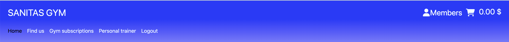

- Messages
    - Messages are shown when you takes certain tasks across the site. To give confirmation that tasks are done Successful tasks are shown in green and errors are shown in red. Such actions are:
        - Login / Logout 
        - Register an account
        - Add products to shoppingbag
        - Update shoppingbag
        - Delete item from shopping bag
        - Checkout complete
        - Different types of errors that can occur during these actions
    - Messages are shown under the navbar on all sites
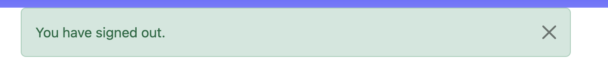
- Main content
    - Here is the content from our different pages loaded. The navbar and footer are shown on all pages except for error pages

- Footer
    - Here you ca find a link to our facebook page. The page opens in a new tab

##### Index page

- Hero image
    - Here you you see our hero image with the headline "Fitness for all". To show you and other users what kind of site you have arrived at.

- Welcome message

    - Here you can see a messagge from us that describes our motto.

- Find Us

    - Here you can find a google map section that shows our location aswell as our adress

- Newsletter sign up
    - Here you can leave a your email adress to get our newsletter

#### Find us

- Here you can find a google map section that shows our location aswell as our adress. This section is located on the ondex page and uses a jump link to scroll down automatically.
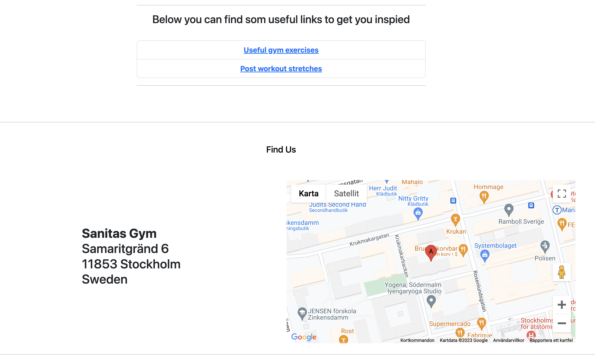
#### Gym subscriptions

- Here you can choose a gym subscription of your choice. Each subscription has different features and prices

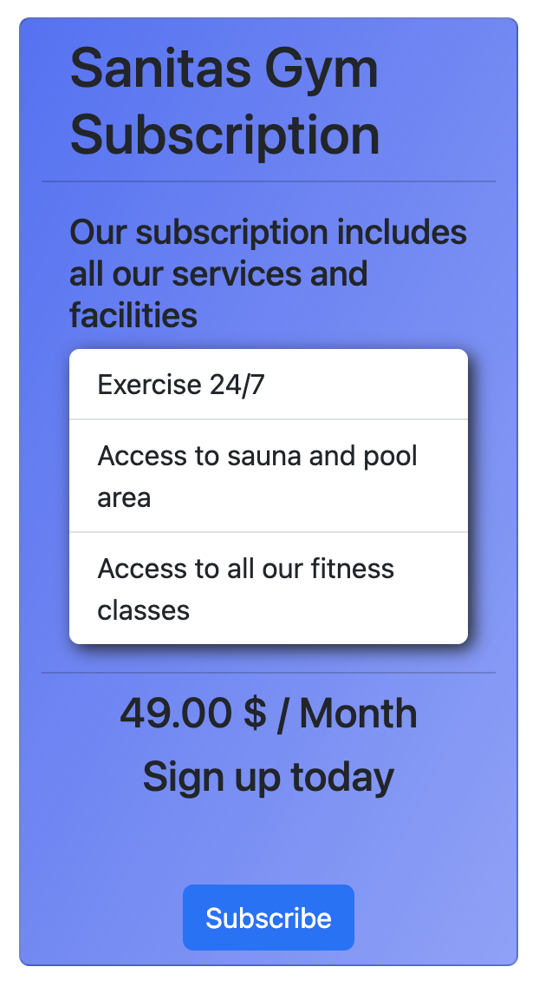

#### Personal trainer sessions

- Here you can purchase one hour personal trainer sessions. Add the number of sessions as you need and add them to your shopping bag
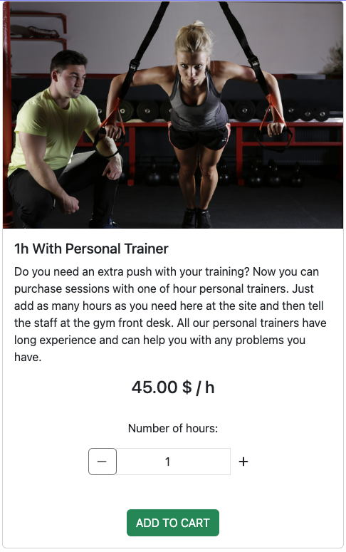
#### Shopping bag page
- Here you can see the number of products in your shopping bag. You can update the quantity by using the increment/decrement buttons and press update. If you want to delete an item from your shopping bag you can press the delete button.

- If you are sattisfied with the content of your bag you can proceed to the checkout via the "Go to checkout" button

- There is also a back to home page link that takes you back to the index page
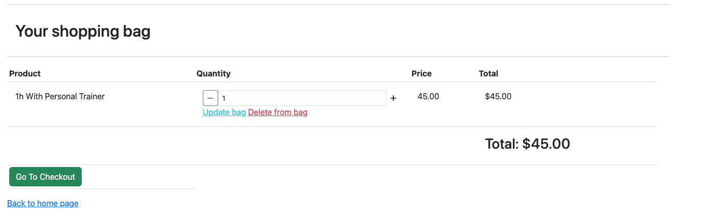
#### Checkout page

- At the top of the page you will see the content of your shopping bag with individual and total price of product

- The next section shows a form with the nessecary information to make a purchase. If you have made a previous made a purchase and checked "Save my information" the fields are already prepopulated from information stored in the user profile.

- Form validations
    - "Full name" is required and takes maximum 100 characters
    - "Email" is required and takes maximum 254 characters and must have the corect email format
    - "Adress" is required and takes maximum 100 characters
    - "Post code" is required and takes maximum 20 characters
    - "City" is reuired and takes maximum 100 characters

- Save my personal info to my profile
 - A checkbox that saves the form information to the members profile and is automatically entered the next time you do a purchase

- Card information
    - Here is a field that you can enter your card information
    - Validators
        - If the wrong card information is entered a message is shown below the input that the information is incorrect
- Subit section
    - "See shooping bag" button takes you back to the shopping bag page
    - "Submit order" button tries to submit the order to stripe and creates an order instance in the databas
     - Validators
        - If the bag is empty an error message is shown
        - If an card error occurs a message will be shown
    - Under the submit buttons a text will show how much your card will be chaged
    - In the bottom of the page you will find a link to get back to the home page
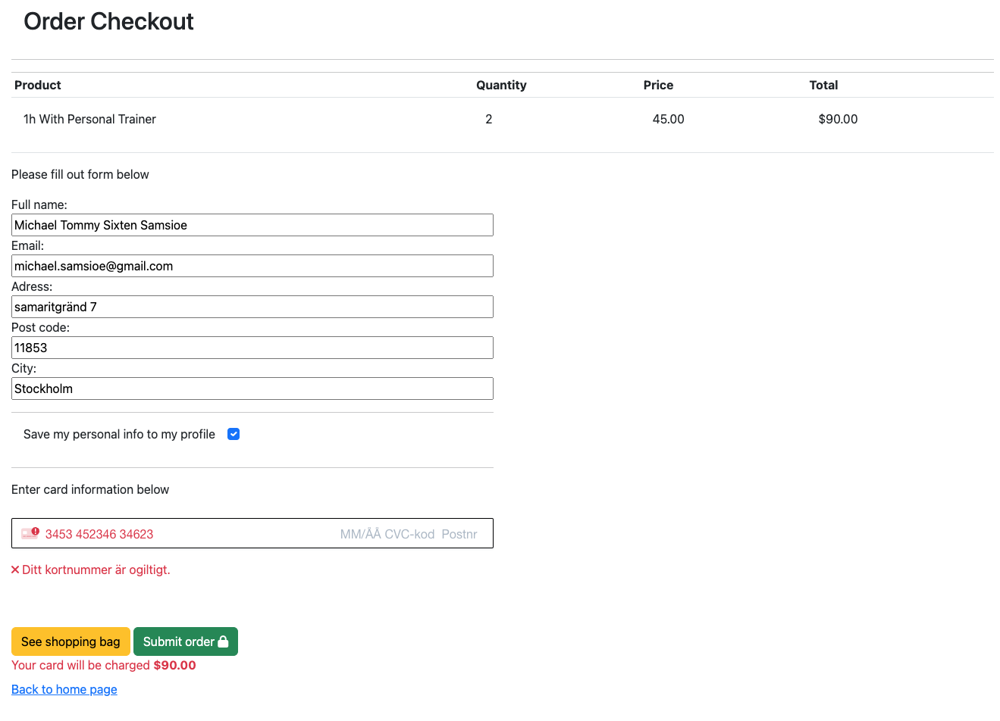
#### Checkout success page

- When a purchase has gone through a checkout success page is shown. It includes order details and ordernumber
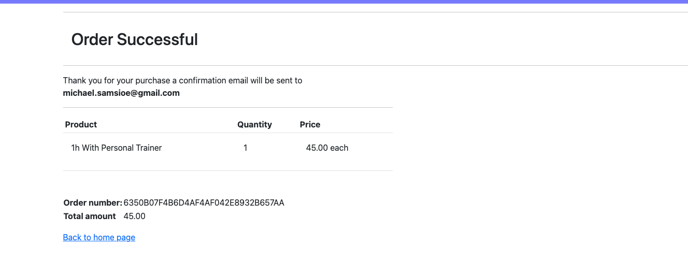
#### Page not found
- A custom "page not found" page is shown if a page is not found. A short message and a link back to the index page is shown

#### Login Reggister and logout

- Register
    - if you don´t have an account you can create one here. The Link will be visible in the navbar if you are not logged in
    - Validators
        - All fields email are required
        - Email fields must have an email format and the confirmation field must match the first email field
        - Password confirm field must match the first pasford field

- Login 
    - Sign in page requires login name and password
    - "Remember me" checkbox is optional if you want the username and password to be saved
    - "Forgot password" link kan be used to reset password if you forget it.
    - You must be logged in to visit members page, add items to shopping bag and subscribe to a gymsubscription

- Logout
    - Before logging out a message will be promted and asks if you are sure if you want to sign out

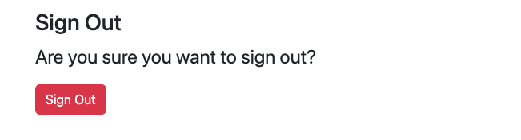
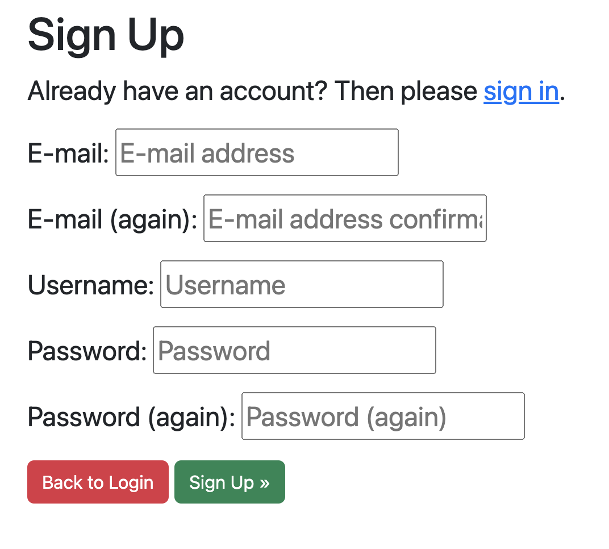

#### Admin Site and models
- Here an admin user can logg in to see an alter orders, prodile, users, memberrships, products and categories

    - Products page is tha page that handles the personal trainer session

    - Orders handles previous orders when purchasing a single payment such as personal trainer session

    - Stripe Customers handles active subscription. And stores the stripe plan and cusstomer id in our database

    - Profile stores saved customer information from previous purchases

    - Categories handles different product categories if other product types is added in the future 
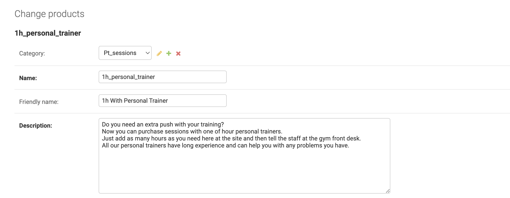
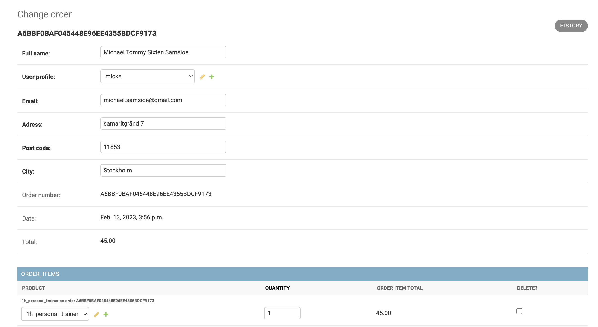
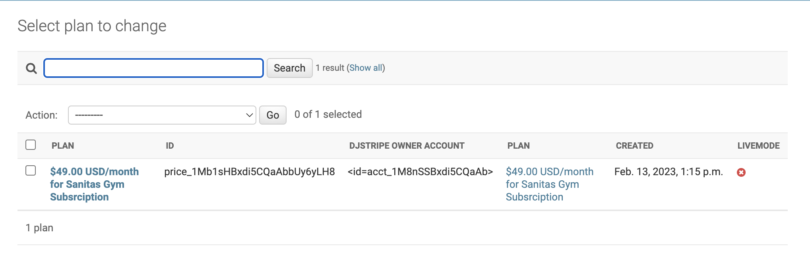

### Features left to implement

- Schedule an personal trainer appointment after purchasing hours. And choose which trainer you want to train with

- Add more tiers on the subscriptions to cater to all customers specific needs

## Testing

### Manual testing

- Login / Logout and register
    - A message is shown when successfully logging in and out
    - A validation error is shown if email has the wrong format
    - A validation error is shown if email and confirm email field does not match
    - A validation error is shown if password is to similar to username
    - A validation error is shown if the password and passwod conifmation field don´t match

- User is authenticated

    - If you redirected to login page if you try to add an item to cart or try to enter members page if you are not logged in

- Shopping bag

    - Messages show when an item is deleted or updated in the shopping bag

- Checkout 

    - A validation error is shown if any of the fields "Full name", "Adress", "Post code", "City" is left empty
    - A validation error is shown if the email field has the wrong format.
    - If checkobox "Save my info to my members page" is unchecked the members page don´t get updated
    - If an invalig card number is entered an error message is shown below
    - If you press the "Submit" button an order is created in the database and the a purchase is added to stripe 

- Newsletter sign up
    - Signup form from mailchimp has been tested that it stores the mail adress on our mailchimp account

### Validator testing

### Unfixed bugs

- Affter installing stripe the confirm email function on all auth stopped working. The link for the confirm email page was not apperaring in the console.

### Fixed bugs
- Update cart button did not work.
    - Fix: the session seamed to have something to to with it because when I deleted the session the button started working again.

## Deployment

## Credits
---

### Borrowed code

#### Bag app

- Context.py 
    - All of the strucutre, logic, function and variable names are taken from Code institute project lessons Boutique ado
- views.py 
    - Most of the logic and function, variable names are taken from Code institute project lessons Boutique ado

#### Checkout app
- stripe_elements.js
    - all code is taken from stripe documentation and Code institute project lessons Boutique ado

- checkout.css
    - Most of the code is taken from Code institute project lessons Boutique ado
- webhooks.py
    - All code is taken from Code institute project lessons Boutique ado
- webhook_handler.py
    - All code is taken from Code institute project lessons Boutique ado
- Signals.py in checkout app
    - All code is taken from Code institute project lessons Boutique ado
- admin.py in checkout app
    - Most of the structure and variable and class names is from Code institute project lessons Boutique ado
- apps.py in checkout app
    - One line of code is taken from Code institute project lessons Boutique ado
- views.py in checkout app
    - Most of the code structure, logic , class names, variable names and logic is taken from Code institute project lessons Boutique ado

#### Profile app
- models.py 
    - Last part of document rows 10 - 20 are heavily influenced by Code institute project lessons Boutique ado
- Views.py
    - Structure and logic are taken from Code institute project lessons Boutique ado

#### Misc
- index.html
    - Hero image is taken from https://www.w3schools.com/howto/howto_css_hero_image.asp
- Home.css
    - Css for hero image and text is taken from https://www.w3schools.com/howto/howto_css_hero_image.asp
- Google maps section
    - code is taken from Code institute lessons on apis
- Mailchimp newsletter sugnup section is taken from https://mailchimp.com

## Content

- The site is styled with bootstrap and css

- Icons are taken from fonawsome

- Google maps section is provided by google

- Newsletter signup is provided by mailchimp

### Media

- Images are taken from pexels.com

# Business plan 

- Business goals
    - Even thou we have a physical location for our gym we see the importance of incorporating e-commerce in our business model. We have a B2C strategy and focuses on customers in södermalm part of Stockholm Sweden. To be able to reach our customers and offer extra services from our gym such as classes and personal trainer sessions. We also want our customers to be able to manage their gym subscriptions from our web application. It is easier to reach customers and et them to convert in the comfort of their own home. 

## Marketing

- Social media

    - Facebook
        - We have a facebook page where we are hoping to grow our comunity organically. This is a solid and free marketing option.
    
    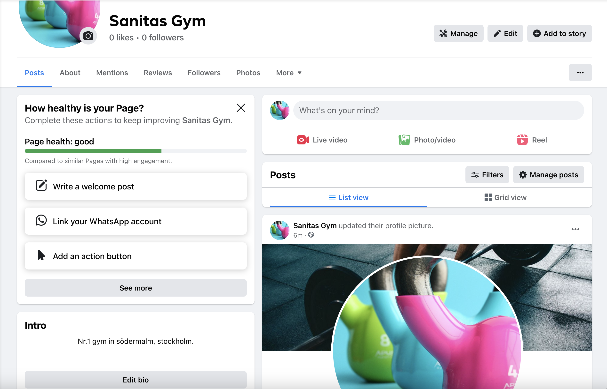

    - Social media ads
       - We are using paid soccial media ads that is shown mainly on instagram and facebook. The ads have teritory restrictions so they only target potential customers in the vicinety of our location

    - Newsletter 
        - On our main page there is a section for leaving your email adress to stay up to date with new offers, classes and subscriptions. This is also a free and great way to stay in contact with your members and create customer retention.

- Googgle seo
    - Efforts have been made to optimize our landing page to match key words of our choice to create organic trafic.
    This is also a great and free way to get new customers 

### Seo 

#### Key words
- Short tail keywords
    - Gym
    - Affordable gym
- Longtail keywords
    - Gym södermalm
    - Best gym södermalm
    - Gym with fitness classes
    - Personal trainer
    - Gym with sauna
    - Gym with pool

- Choice of keywords:
    - For short tail keywords I have choosen a general term "Gym" and "Affordable gym". But i think it still works since we only have one gymlocation and google knows where you are so the results felt relevat anyway . Googel will present you with the closest options. An auto complete option that google presented me with was "Affordable gym" which had less searches on it and felt mor competative.

    - For long tail key words i have choosen two key words that includes södermalm which is the part of stockholm where the gym i situated. Another suggestion by google where "best gym södermalm". To be more competative the rest of the keywords focus on our services and facileties. Local competitors does not offer the same services. "Gym with fitness classes" and "gym with sauna and pool" have ok search volume and are more competative than broader search terms.

    - In my analysis I have taken in to consideration relevance authority and volume aswell as competition.
    I wanted to use a service like wordtracker.com but Sweden was not an option for teritory unfortunately.

### Site map

