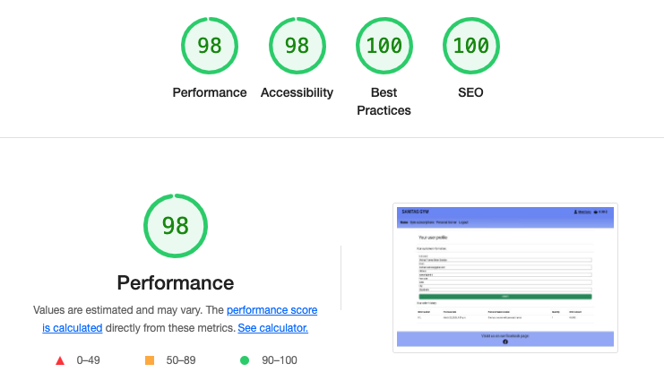
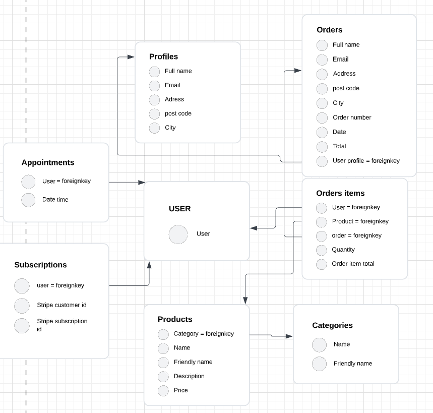
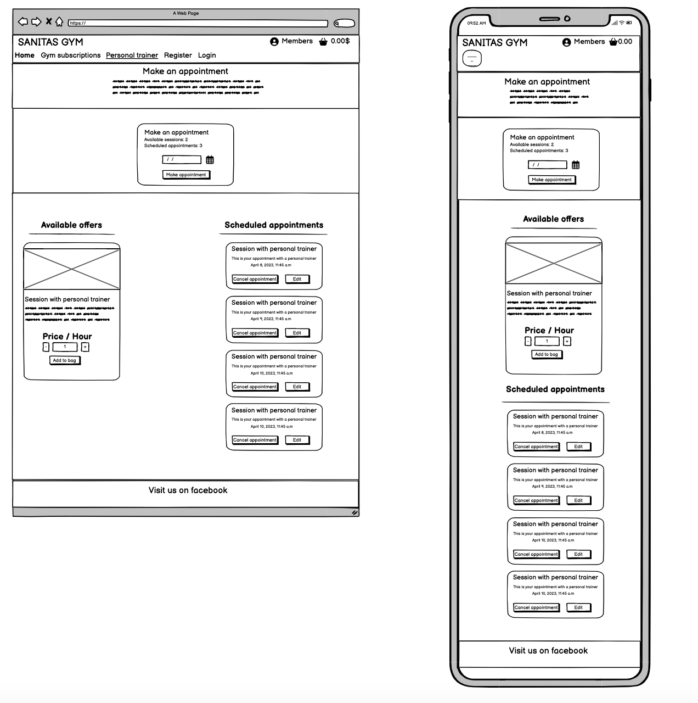

# Sanitas Gym
---
Welcome to Sanitas Gym's site. We are a gym situated in the heart of stockholm. On our site the you can choose a gymsubscription of your choice with recurring payments. And even purchase personal trainer sessions of 1 hour each. Pay right here on the site and tell our staff when you want to use one of your sessions.
---
## Features
--- 
 ### Exisiting Features

 #### Base template

 - Logo
    - Here you can see our Gym name and if you click it you will get back to our index page.

 - Shopping bag
    - Here you can see a cart symbol. If you press it you will be taken to our shoppingbag page. Next to the cart icon you will see the total amount in the cart at the moment

 - Members page
    - Here you can see your current delivery information if you have done a previous purchase. Otherwise you can fill in your information and press update

 - Navigation 

    - Our navigation consist of four manin options plus additional options for login and registration.

        - "Home" takes you back to our indexpage
        - "Find us" useses a jump link to take you to our google maps section frther down on the index page.
        - "Gym Subscriptions" takes you to our subscriptions page where you can choose a subscription of your choice.
        - "Personal trainer" takes you to our personal trainer session page. Here you can purchase sessions with one of our trainers. One session last for one hour. Just tell our staff when you need a trainer.
    - Login logout and registration
        - If you are logged in you will see a link "Logout" otherwise you will see two links "Register and "Login"


- Messages
    - Messages are shown when you takes certain tasks across the site. To give confirmation that tasks are done Successful tasks are shown in green and errors are shown in red. Such actions are:
        - Login / Logout 
        - Register an account
        - Add products to shoppingbag
        - Update shoppingbag
        - Delete item from shopping bag
        - Checkout complete
        - Different types of errors that can occur during these actions
    - Messages are shown under the navbar on all sites

- Main content
    - Here is the content from our different pages loaded. The navbar and footer are shown on all pages except for error pages

- Footer
    - Here you ca find a link to our facebook page. The page opens in a new tab

##### Index page

- Hero image
    - Here you you see our hero image with the headline "Fitness for all". To show you and other users what kind of site you have arrived at.

- Welcome message

    - Here you can see a messagge from us that describes our motto.

- Find Us

    - Here you can find a google map section that shows our location aswell as our adress

- Newsletter sign up
    - Here you can leave a your email adress to get our newsletter

#### Find us

- Here you can find a google map section that shows our location aswell as our adress. This section is located on the ondex page and uses a jump link to scroll down automatically.

#### Gym subscriptions

- Here you can choose a gym subscription of your choice. Each subscription has different features and prices


#### Personal trainer sessions

- Here you can purchase one hour personal trainer sessions. Add the number of sessions as you need and add them to your shopping bag

#### Shopping bag page
- Here you can see the number of products in your shopping bag. You can update the quantity by using the increment/decrement buttons and press update. If you want to delete an item from your shopping bag you can press the delete button.

- If you are sattisfied with the content of your bag you can proceed to the checkout via the "Go to checkout" button

- There is also a back to home page link that takes you back to the index page

#### Checkout page

- At the top of the page you will see the content of your shopping bag with individual and total price of product

- The next section shows a form with the nessecary information to make a purchase. If you have made a previous made a purchase and checked "Save my information" the fields are already prepopulated from information stored in the user profile.

- Form validations
    - "Full name" is required and takes maximum 100 characters
    - "Email" is required and takes maximum 254 characters and must have the corect email format
    - "Adress" is required and takes maximum 100 characters
    - "Post code" is required and takes maximum 20 characters
    - "City" is reuired and takes maximum 100 characters

- Save my personal info to my profile
 - A checkbox that saves the form information to the members profile and is automatically entered the next time you do a purchase

- Card information
    - Here is a field that you can enter your card information
    - Validators
        - If the wrong card information is entered a message is shown below the input that the information is incorrect
- Subit section
    - "See shooping bag" button takes you back to the shopping bag page
    - "Submit order" button tries to submit the order to stripe and creates an order instance in the databas
     - Validators
        - If the bag is empty an error message is shown
        - If an card error occurs a message will be shown
    - Under the submit buttons a text will show how much your card will be chaged
    - In the bottom of the page you will find a link to get back to the home page

#### Checkout success page

- When a purchase has gone through a checkout success page is shown. It includes order details and ordernumber

#### Page not found
- A custom "page not found" page is shown if a page is not found. A short message and a link back to the index page is shown

#### Login Reggister and logout

- Register
    - if you don´t have an account you can create one here. The Link will be visible in the navbar if you are not logged in
    - Validators
        - All fields email are required
        - Email fields must have an email format and the confirmation field must match the first email field
        - Password confirm field must match the first pasford field

- Login 
    - Sign in page requires login name and password
    - "Remember me" checkbox is optional if you want the username and password to be saved
    - "Forgot password" link kan be used to reset password if you forget it.
    - You must be logged in to visit members page, add items to shopping bag and subscribe to a gymsubscription

- Logout
    - Before logging out a message will be promted and asks if you are sure if you want to sign out


#### Admin Site
- Here an admin user can logg in to see an alter orders, prodile, users, memberrships, products and categories

    - Products page is tha page that handles the personal trainer session

    - Orders handles previous orders when purchasing a single payment such as personal trainer session

    - Stripe Customers handles active subscription. And stores the stripe plan and cusstomer id in our database

    - Profile stores saved customer information from previous purchases

    - Categories handles different product categories if other product types is added in the future 


### Features left to implement

- Schedule an personal trainer appointment after purchasing hours. And choose which trainer you want to train with

- Add more tiers on the subscriptions to cater to all customers specific needs


## Testing

## Manual testing

### Navbar and footer
- All links work and the page you visit get underlined in the navbar
- Facebook link in footer works and opens up in a new window with rel=noopener atribute

### Home page

- Newsletter sign up
    - Signup form from mailchimp has been tested that it stores the mail adress on our mailchimp account
- External links work and opens in a new window with rel=noopener atribute

### Login / Logout and register
- A message is shown when successfully logging in and out
- A validation error is shown if email has the wrong format
- A validation error is shown if email and confirm email field does not match
- A validation error is shown if password is to similar to username
- A validation error is shown if the password and passwod conifmation field don´t match

### Gym subscriptions

- If you do not have a subscription a button will show in the subscription card that says 'Subscribe' it will take you to a checkout page hosted by stripe. After successful chekout you will be taken back to a sucess page hosted on the santitas site. If you go back to the subscriptions page you will see a new red button that says 'Cancel subscription'
  
- If you already have an active subscription and try to run the view 'create_checkout_session' from the url you will be redirected back to subscriptions page and shown an error message
- If don´t have an active subscription and try to run the view 'cancel_sub' from the url you will be redirected back to subscriptions page and shown an error message
    

### Personal Trainer
(Please observe that the time zone is set to CET in settinggs.py)
- Schedule session with personal trainer
    - Form works to submit and a session is saved to the database
    - If you have purchased a sesssion with a personal trainer you can see the available sessions you can schedule and also how many you have purchased
    - Form validation
        - If you try to schedule a sessions with 0 available you will get a form validation error
        - You try to schedule an appoint ment before current time plus one hour you will get a form validation error
        - If you try to schedule an appointment when you already have an appointent you will get a form validation error
        !
- Edit Session
    - Edit button takes you to the edit page. "Save" button updates the database with new time and date. "Back" button takes you back to the personal trainer page
    - "Cancel session" button shows a modal with the question if you sure. "Cacel" button cancels the session and "Close" button closes the modal
    - On the edit page all form validations are show in the same way as on the create form
    - If a scheduled session is closer in time than one hour you can no longer edit or cancel it
    
    - If you try to edit another users session via the url you will be taken to a page with a message that you are trying to edit another users session.
    
    - If you try to delete an other users session via the url get shown a message that you are trying to delete another users session

- Purchase personal trainer session
    - increment and decrement buttons changes the value in input window
    - "Add to bag" button works and add the correct quantity to the shopping bag. Adding product again increments the quantity in the shopping bag
    - A message is shown when a product is added to the shopping bag


     


### Shopping bag page
- increment and decrement buttons changes the value in input window
- "Update bag" and "Delete from bag" links both work as expected
- A messages show when an item is deleted or updated in the shopping bag
- "Go to checkout" button takes you to checkout page with the correct shopping bag
- "Back to home page" link works and takes you back to the home page

### Checkout page
- The corret product, quantity, price and total is shown
- A validation error is shown if any of the fields "Full name", "Adress", "Post code", "City" is left empty
- A validation error is shown if the email field has the wrong format.
- If checkobox "Save my info to my members page" is unchecked the members page don´t get updated
- If an invalig card number is entered an error message is shown below
- If you press the "Submit order" button an order is created in the database, the a purchase is added to stripe and you are taken to the success page
- "Back to shopping bag" takes you to the shoppingbag
- "Back to home page" link works and takes you back to the home page
- "Save my info to my members page" checkbox saves adress to the profile database if it is checked

### Members/Profile page
- User profile is already populated if save checkbox is checked on checkout
- Validation on all field works
- "Update" button works and successfully saves the new user profile
- Orderhistory is shown in the bottom of the page


### If user is not logged in

- Members page
    - If you try to click members page you get redirected to login page with a message shown that you need to be logged in.
- Shopping bag page
    - If you try to click the shoppingbag you get redirected to login page with a message shown that you need to be logged in.
- Subscriptions page
    - If you enter the subscription page you will see the subscription information but where the button to subscribe or cancel subscription you will see a link to login page
    - If you try to run views 'create_checkout_session' and 'cancel_sub' via the url you get redirected to log in page
    
- Personal trainer page
    - If you enter the personal trainer page you will see a link to the login page that says you need to be logged in to schedule and purchase sessions
    - If you try to run the views 'edit_appointment' or 'delete_appointment' from url you get redirected to login page
    

### Light house testing 
- Lighthouse testing is made on all main pages. All tests passed, however there is a bad testresult on performance on the home page. I think it is because of the hero image. I have already compressed the image two times but I only seam to get it down to 1 mb from 4 md. 
    - Home page
        
    - Subscriptions page
        
    - Personal trainer page
        
    - Shopping bag page
        
    - Checkout page
        
    - Profile page
        

### Validator testing

- HTML using 

- Css using

- Python using infoheap

- Lighthouse accessability


### Unfixed bugs

- Affter installing stripe the confirm email function on all auth stopped working. The link for the confirm email page was not apperaring in the console.

### Fixed bugs
- Update cart button did not work.
    - Fix: the session seamed to have something to to with it because when I deleted the session the button started working again.

- Webhooks did not work
    - Fix: ports where set to private instead of public

## Deployment

### Database
- Create a new database on ElephantSQL
    - Create a new instance
    - Give it a name
    - Select the free plan "Tiny Turtle"
    - Select region closest to you
    - Copy data base url from new instance

### Heroku
- Create a new app  on Heroku 
    - Pick a name for your app
    - Choose region
    - Delete the Heroku postgres add-on under the resource tab which is added automatically. If you don't it will overwrite your database_url from ElephantSQL
    - Under settings press the button "reveal config vars" add "DATABASE_URL" variabel with key URL from ElephantSQL and all config variables from your env.py file needed to run the app

### Project code preparations and heroku settings
- Install packages dj_database and psycopg2 using command "pip3 install dj_database_url==0.5.0 psycopg2"
- Freeze packages to your requirements.txt using command "pip freeze > requirements.txt"
- Changes to settings.py file
    - Import os and import dj_database_url at the top of the file
    - In the DATABASES section
        - Comment out your default database used in local enviroment like sqlite3
        - Connect to new database on Elephantsql using snippet below
            ```
             DATABASES = {
                'default': dj_database_url.parse('your-database-url-here')
                }
            ```
        - Run command "python3 manage.py showmigrations" to show migrations that has not yet been migrated to the new database
        - Run command "python3 manage.py migrate" to migrate to new database
        - Run command "python3 manage.py createsuperuser" to create a new superuser for the new database on Elephantsql
        - Add if statement below to use Elephantsql database when running live version on Heroku and sqlite3 database when running app locally

            ```
            if 'DATABASE_URL' in os.environ:
                DATABASES = {
                    'default': dj_database_url.parse(os.environ.get('DATABASE_URL'))
                }
            else:
                DATABASES = {
                    'default': {
                        'ENGINE': 'django.db.backends.sqlite3',
                        'NAME': os.path.join(BASE_DIR, 'db.sqlite3'),
                    }
                }
            ```
        - In ElephantSQL database instance press browse and check that the tables and your new superuser has been added to the data base
- Preparation for running app on heroku
    - Run command "Pip install gunicorn" to installl gunicorn which will work as webserver
    - Freeze packages to your requirements.txt using command "pip freeze > requirements.txt"
    - Create a procfile which will tell heroku to create a webdyno which will run Gunicorn and serve our django app. The procfile should contain "web: gunicorn sanitas_gym.wsgi:application"
    - Log in to heroku app using command "heroku login -i" give email adress when prompted and api key fom settings tab in heroku when prompted to enter a password
    - Disable collect static with command " heroku config:set DISABLE_COLLECTSTATIC=1 --app sanitas-gym"
    - In settings.py under ALLOWED_HOSTS add ['sanitas-gym.herokuapp.com', 'localhost'] to allow both heroku app and local enviroment to access
    - Commit changes and push to github
    - Deploy to Heroku using command "git push heroku main". If you initialize your app on the web site you may have to initialize the app remote using command "heroku git:remote -a sanits-gym" before deploying to heroku
    - In Heroku app go to deploy tab. Choose deployment method github and find your repository and click connect
    - Enable automatic deploy so that when a new version is saved the app is deployed automatically
    - Generate a new django secret key using a key generator. Add new secret key to heroku config vars
    - Remove any live credentials from settings.py and instead use a enviroment variable like os.environ.get('SECRET_KEY',) from env.py
    - Add if statement to turn on DEBUG in settings.py if there is an enviroment variable 'DEVELOPMENT'. See example below
        ````
            if os.environ.get('DEVELOPMENT'):
                debug_on = True
            else:
                debug_on = False

            DEBUG = debug_on
        ```
    - Commit and push to github


### Amazon web services and static files
- Create an account on amazon web services
- Sign in and enter management console under my account
- Search for service S3
- Create a new bucket and allow public access. Enable ACLs enabled and choose Bucket Owner preferred
- In the new bucket in the properties tab turn on static web site hosting and choose "Use this bucket to host a website". Fill in default values and press save
- In the permissions tab
    - Set CORS configuration. which allows access between heroku app and s3 bucket. Add code below to the CORS field
    ```
            [
        {
            "AllowedHeaders": [
                "Authorization"
            ],
            "AllowedMethods": [
                "GET"
            ],
            "AllowedOrigins": [
                "*"
            ],
            "ExposeHeaders": []
        }
    ]
    ```
    - Go to bucket policy and select policy generator to create a policy. 
        - Choose policy type S3 bucket policy 
        - Allow all principals by ussing a *
        - Choose action get object
        - Copy ARN number from policy tab and paste it to arn box at the bottom
        - Click add statement
        - Click generate policy
        - Copy policy in the the pollicy editor on the permissions tab and add a /* after like resource: .. sanitas-gym/* to allow access to all resources in bucket
        - Choose the following settings in the ACL section: Bucket owner: objects_ [list=x, write=x], BucketACL_ [read=X, write=x] Everyone: Objects_ [list=x ,]

- Go back to services menu and open IAM service
    - Click User Groups
        - Create a new group and name it 
    - Create Policy go to JSON tab and click import managed policy search for S3 and import S3 full access policy
    - Get the bucket ARN number from S3 bucket
    - In the JSON field in IAM paste two rows in a list as the resource value like the example below
    ```
      Resource: ["arn233242342:::sanitas-gym",
        "arn233242342:::sanitas-gym"/*]
    ```
    - Click next tags are optional until you get to review policy. Give it a name and description and click create policy
    - Go back to User Groups and click your created user group go to permissions tab open "add permissions" and click attache polecies select the polecy and click add permission. and attache policy. 
    - Create a user and pick a name. Put user in group
    - Access the user and click security credentials and click access keys to give programaticall access. Create and download the csv file which will include secret credentials keys

- In gitpod install packages boto3 using command "pip install boto3"
- In gitpod install packages django storages using command "pip install django-storages"
- Freeze packages to your requirements.txt using command "pip freeze > requirements.txt"
- Add storages to installed apps in settings.py
- Add the following code snippet to settings.py
```
if 'USE_AWS' in os.environ:
    # Cache control
    AWS_S3_OBJECT_PARAMETERS = {
        'Expires': 'Thu, 31 Dec 2099 20:00:00 GMT',
        'CacheControl': 'max-age=94608000',
    }

    # Bucket config 2
    AWS_STORAGE_BUCKET_NAME = 'sanitas-gym'
    AWS_S3_REGION_NAME = 'eu-north-1'
    AWS_ACCESS_KEY_ID = os.environ.get('AWS_ACCESS_KEY_ID')
    AWS_SECRET_ACCESS_KEY = os.environ.get('AWS_SECRET_ACCESS_KEY')
    AWS_S3_CUSTOM_DOMAIN = f'{AWS_STORAGE_BUCKET_NAME}.s3.amazonaws.com'

    # Static and media files
    STATICFILES_STORAGE = 'custom_storages.StaticStorage'
    STATICFILES_LOCATION = 'static'
    DEFAULT_FILE_STORAGE = 'custom_storages.MediaStorage'
    MEDIAFILES_LOCATION = 'media'

    # Static and media files
    STATICFILES_STORAGE = 'custom_storages.StaticStorage'
    STATICFILES_LOCATION = 'static'
    DEFAULT_FILE_STORAGE = 'custom_storages.MediaStorage'
    MEDIAFILES_LOCATION = 'media'

    # Override static and media URLs in production
    STATIC_URL = f'https://{AWS_S3_CUSTOM_DOMAIN}/{STATICFILES_LOCATION}/'
    MEDIA_URL = f'https://{AWS_S3_CUSTOM_DOMAIN}/{MEDIAFILES_LOCATION}/'
    

```
- Add AWS_ACCESS_KEY_ID , AWS_SECRET_ACCESS_KEY to enviromentals variables on heroku settings. Theses can be found in the csv file downloaded from AWS

- Create new file in root level "custom_storages.py" to tell django to fetch static and media files from s3 aswell as uploaded images
    - Add the following code snippet:
    ````
        from django.conf import settings
    from storages.backends.s3boto3 import S3Boto3Storage


    class StaticStorage(S3Boto3Storage):
        location = settings.STATICFILES_LOCATION


    class MediaStorage(S3Boto3Storage):
        location = settings.MEDIAFILES_LOCATION
    ```
- Commit and push to github
- Top of snippet under comment "# cache controle" is added to handle cashing of files to increase user performance
- In S3 bucket create folder called "media" with bucket settings
    - Click upload
    - Choose all images you need to upload
    - Grant public access to objects
    - Click next then upload


## Credits
---


### Borrowed code

#### Bag app

- Context.py 
    - All of the strucutre, logic, function and variable names are taken from Code institute project lessons Boutique ado
- views.py 
    - Most of the logic and function, variable names are taken from Code institute project lessons Boutique ado


#### Checkout app
- stripe_elements.js
    - all code is taken from stripe documentation and Code institute project lessons Boutique ado

- checkout.css
    - Most of the code is taken from Code institute project lessons Boutique ado
- webhooks.py
    - All code is taken from Code institute project lessons Boutique ado
- webhook_handler.py
    - All code is taken from Code institute project lessons Boutique ado
- Signals.py in checkout app
    - All code is taken from Code institute project lessons Boutique ado
- admin.py in checkout app
    - Most of the structure and variable and class names is from Code institute project lessons Boutique ado
- apps.py in checkout app
    - One line of code is taken from Code institute project lessons Boutique ado
- views.py in checkout app
    - Most of the code structure, logic , class names, variable names and logic is taken from Code institute project lessons Boutique ado

#### Profile app
- models.py 
    - Last part of document rows 10 - 20 are heavily influenced by Code institute project lessons Boutique ado
- Views.py
    - Structure and logic are taken from Code institute project lessons Boutique ado

#### Subscriptions app
    - models code is taken from https://testdriven.io/blog/django-stripe-subscriptions/
    - 

#### Misc
- index.html
    - Hero image is taken from https://www.w3schools.com/howto/howto_css_hero_image.asp
- Home.css
    - Css for hero image and text is taken from https://www.w3schools.com/howto/howto_css_hero_image.asp
- Google maps section
    - code is taken from Code institute lessons on apis
- Mailchimp newsletter sugnup section is taken from https://mailchimp.com

- timer java script function in base.html is taken from a Code institute lesson

## Content

- The site is styled with bootstrap and css

- Icons are taken from fontawsome

- Font 'Robot condensed' is taken from google fonts 

- Google maps section is provided by google

- Newsletter signup is provided by mailchimp

- Mockups is made with https://balsamiq.cloud/

- Data base models schema is made with https://lucid.app/


### Media

- Images are taken from pexels.com

# Business plan 

- Business goals
    - Even thou we have a physical location for our gym we see the importance of incorporating e-commerce in our business model. We have a B2C strategy and focuses on customers in södermalm part of Stockholm Sweden. To be able to reach our customers and offer extra services from our gym such as classes and personal trainer sessions. We also want our customers to be able to manage their gym subscriptions from our web application. It is easier to reach customers and et them to convert in the comfort of their own home. 

## Marketing

- Social media

    - Facebook
        - We have a facebook page where we are hoping to grow our comunity organically. This is a solid and free marketing option.
        You can see som imagges below
    
    

    - Social media ads
       - We are using paid soccial media ads that is shown mainly on instagram and facebook. The ads have teritory restrictions so they only target potential customers in the vicinety of our location

    - Newsletter 
        - On our main page there is a section for leaving your email adress to stay up to date with new offers, classes and subscriptions. This is also a free and great way to stay in contact with your members and create customer retention.

- Googgle seo
    - Efforts have been made to optimize our landing page to match key words of our choice to create organic trafic.
    This is also a great and free way to get new customers 

### Seo 

#### Key words
- Short tail keywords
    - Gym
    - Affordable gym
- Longtail keywords
    - Gym södermalm
    - Best gym södermalm
    - Gym with fitness classes
    - Personal trainer
    - Gym with sauna
    - Gym with pool

- Choice of keywords:
    - For short tail keywords I have choosen a general term "Gym" and "Affordable gym". But i think it still works since we only have one gymlocation and google knows where you are so the results felt relevat anyway . Googel will present you with the closest options. An auto complete option that google presented me with was "Affordable gym" which had less searches on it and felt mor competative.

    - For long tail key words i have choosen two key words that includes södermalm which is the part of stockholm where the gym i situated. Another suggestion by google where "best gym södermalm". To be more competative the rest of the keywords focus on our services and facileties. Local competitors does not offer the same services. "Gym with fitness classes" and "gym with sauna and pool" have ok search volume and are more competative than broader search terms.

    - In my analysis I have taken in to consideration relevance authority and volume aswell as competition.
    I wanted to use a service like wordtracker.com but Sweden was not an option for teritory unfortunately.


# Data models schema
- Appointments
    - Has two fields Date_time and one foreign key to the user model. That way you can store at what time the sessions is scheduled for each user.
- Subscriptions
    - Has three fields with customer and subscription id and has a foreign key to the user model. To keep track of what subscription is tied to what customer and user.
- Products
    - products has 5 fields with standard product info such as price, name decription. It also has a foreign key to the model categories. Today there are only one category of product but in the future as more is added the setup with categories is already set.
- Categories
    - This is a simple model with two fields for name and friendly name with no foreign keys
- Orders
    - Has fields for customer info like adress, name, email etc. With one foreign key to Profile so you can connect a user profile with an order and save your customer info to your profile..
- Order items
    - Are all the information about the purchased items such as quantity, order total, products. It has three foreign keys:
        - Foreignkey to "User model" to connect purchased items to a user. In this case it is neede to calculate the number of purchased personal trainer sessions for a user.
        - Foreignkey to "Products model" to connect a product to order items instance.
        - Foreignkey to "Order model" every order items insctance is tied to a an order so that you know which order number and date etc is connected to purchased items 
- Profile
    - Consists of fields that is saved customer info that is prepopulated in the checkout if it is previuosly saved.

- Below you can find a schema of the all database model relationships



# Responsiveness
- All pages are tested that they are responsive
    - Home
    
    
    - Subscriptions page
    
    - Personal trainer page
    
    - Shopping bag page
    
    - Chechout page
    
    - Profile
    


# Mockups
- This is mockups created on balsamic.com
    - Home
    
    - Subscriptions page
    
    - Personal trainer page
    
    - Shopping bag page
    
    - Chechout page
    
    - Profile
    
